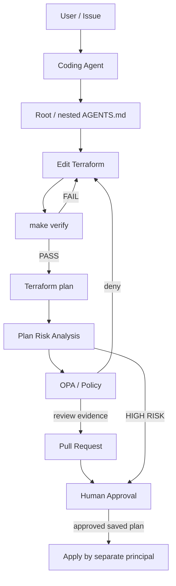
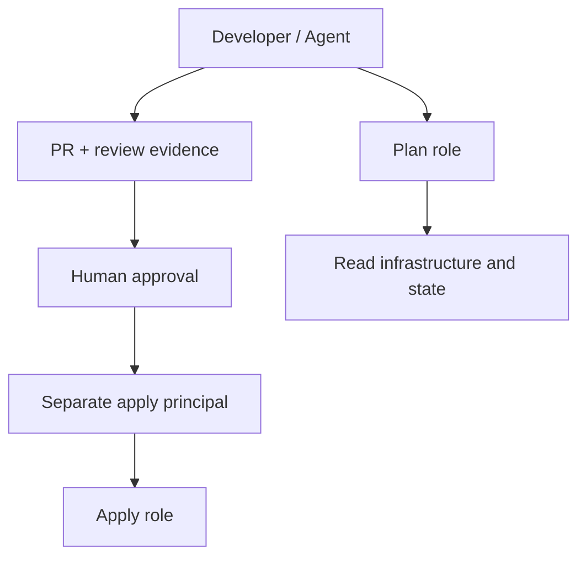

# agentic-iac-template

Terraform AWS Harness Engineering sample.

AIコーディングエージェントがTerraformを**安全・再現可能・検証可能**に変更するための、
小さな実践リポジトリです。AWSへ接続しないMock検証を標準入口にし、実plan、policy、
人間の判断、apply権限を分離します。Codex、Claude Code、Copilot系などで共通の考え方を使えます。

**まず `make verify`。実AWSのplanは明示的な設定後のみ。production applyは実装しません。**
生成時点の実行結果と未検証項目は [VALIDATION.md](VALIDATION.md) を参照してください。

## 1. Harness Engineeringとは

ここでは、Agentの周囲に「永続的な作業指示・許可する道具・検証器・権限境界・人間への引き渡し」を
設計することをHarness Engineeringと呼びます。モデルの自信ではなく、機械的なPASS/FAILと
レビューできる証拠で次の段階へ進む仕組みです。

Terraformには宣言的コード、provider schema、plan、test、stateという境界があり、
コードの正しさと実際のインフラ変更を段階的に検証できます。ただしplanにもprovider実行と
実環境のreadがあり、stateにも機密情報が入るため、planを無害な文字列生成とは扱いません。

| 原則 | 実装 |
|---|---|
| Deterministic validation | 固定版・lockfile・単一wrapper・assertion・非ゼロ終了 |
| Least privilege | PR検証はAWS認証なし、plan roleとapply roleを分離 |
| Progressive trust | read → edit → test → plan → policy → approval → apply |
| Golden Path | 承認済みnetwork/application moduleを各環境から組み合わせる |
| Human Gate | production、高リスク差分、state操作は人間へ引き渡す |
| Simple over clever | Terraform標準test、短いshell/Python、OPA。独自実行基盤は作らない |

## 2. Repository構成

| Path | 役割 |
|---|---|
| `AGENTS.md` | Agentの永続的な共通契約 |
| `modules/network/` | VPC、public/private subnet、route、IGW、SG、Mock test、追加指示 |
| `modules/application/` | S3、暗号化、公開防止、TLS policy、bucket限定IAM policy、Mock test |
| `environments/{dev,staging,prod}/` | 独立root、S3 backend宣言、変数、example、composition test |
| `environments/prod/AGENTS.md` | productionでの停止・人間への引き渡し |
| `policies/opa/` | plan JSON向けRego v1 policyと正例・負例 |
| `scripts/` | verify / plan / policy、plan要約、Python regression test |
| `fixtures/plans/` | AWSなしでrisk/policyを試す合成plan JSON |
| `.github/workflows/` | 認証不要のPR検証と、opt-inの実AWS plan |
| `docs/` | toolchain、承認済みmodule、context取得、state、production gate |

S3はVPCに所属しないため、applicationへ形式的なnetwork依存は渡しません。
将来compute moduleを追加する際にnetworkのsubnet/SG outputを利用できます。
単一AZ・NATなし・computeなし。public subnetはIGWへのrouteを持ちますがpublic IPの自動割当は無効、
private subnetはinternet default routeを持ちません。SGはingress/egressとも閉じています。

## 3. Agent workflow



HIGH RISKから人間への通知は、policyやPRを省略できる経路ではありません。
通常はdraft PRの作成・更新を繰り返します。添付CIのreal planはdefault branchのレビュー済みコードで
実行するため、merge後にもplan内容への実行承認を行います。詳細は [Production Gate](docs/production-gate.md)。

AgentはIssueの意図を確認し、root/nested AGENTSを読み、固定版の公式資料を参照して小さく編集します。
`make verify` の失敗は修正して再実行し、実planを作れない場合は未実行と明記します。
共有module変更はprodへの波及を確認します。AGENTSを自動で読まないclientには起動時に明示的に読ませます。

## 4. ローカルで試す

前提はBash、Make、Python 3.10以上、[固定版toolchain](docs/toolchain.md) のTerraform/TFLint/OPAです。
AWS account、access key、HCP Terraform、有料サービスはMock検証に不要です。
ただし初回initにはRegistry/provider配布元への通信が必要です。完全オフラインとは異なります。

```bash
make verify
```

この1コマンドは5つのrootをすべて検証し、途中失敗で非ゼロ終了します。
ツールが欠けている場合もFAILとなり、黙って検証を省略しません。

OPAをまだ持っていない場合、以下の入口で理解と部分検証を進められます。

```bash
make validate
make test
make lint
make python-test
python3 scripts/plan_summary.py fixtures/plans/unsafe.json --environment prod
```

これらは `make verify` 全体のPASSを意味しません。Terraform/TFLintがなければそれらの入口も実行不可です。
Pythonだけでも合成planのrisk要約とその回帰テストを実行できます。

OPAを導入すると、`make demo` で安全fixtureの集計とpolicy評価、`make policy-test` で負例も試せます。
`fixtures/plans/*.json` は説明用に手で作った入力であり、実AWSや現在のHCLから生成したplanではありません。

## 5. Verification loop

| 入口 | 処理 | AWS API |
|---|---|---|
| `make fmt` | `terraform fmt -recursive` で書式修正 | 不要 |
| `make validate` | 各rootで `init -backend=false -lockfile=readonly` → validate | 不要 |
| `make test` | 各rootでbackend無効init → `terraform test` | Mockのため不要 |
| `make lint` | 各rootでTFLintの同じ設定・固定版 | 不要 |
| `make policy-test` | Rego strict check / test / safe・unsafe fixtureの実行 | 不要 |
| `make verify` | fmt **check** → init / validate / test / lint → Python → policy-test | 不要 |
| `make plan` | S3 backend init → real plan → JSON → risk → policy | **必要** |
| `make policy ENV=dev PLAN_JSON=/absolute/plan.json` | 外部指定の環境を使ったplan policy評価 | 不要 |

`make verify` は書式を自動修正せず、差分があればFAILにします。
verifyとreal planで `TF_DATA_DIR` を分け、検証時にbackendメタデータを混用しません。
すべてdefault workspaceを使い、環境はディレクトリと独立stateで隔離します。
CLI引数の暗黙追加 `TF_CLI_ARGS*` は拒否します。wrapperのfail-fastは権限sandboxではありません。

## 6. Terraform test / Provider Mocking

すべての `.tftest.hcl` は `mock_provider "aws"` と `command = plan` を使います。
`override_during = plan` と明示したmock値により、出力assertionを未知値やランダムIDに依存させません。
mockでも実provider schemaのインストールが必要です。Mock以外のtestはapplyを実行し得るため、
PR test jobにcredentialを渡しません。

- network: plan成功、CIDR導出、tag、public IP無効、SG通信なし、private route、output。
- application: 公開防止、SSE-S3、versioning、ownership、TLS拒否policy、限定IAM、tag、output。
- 負例: public VPC CIDR、空owner、不正bucket名、不正environment。
- 3環境: module composition、固定environmentの一致、環境名の付け替え拒否。

MockはAWS APIの制約、IAMの実効権限、bucket名の空き、quotas、AZの存在、実stateとのdriftを検証しません。
有効なmock文字列が、本番APIで有効とは限りません。実planと小さなsandbox integration testが別途必要です。

## 7. Plan Risk Analysis

実環境の設定が済んだら、exampleを別のprivateな絶対パスへコピーして値を設定し、短命のplan credentialで実行します。

```bash
make plan ENV=dev \
  VAR_FILE=/absolute/private/dev.tfvars \
  BACKEND_CONFIG=/absolute/private/dev.s3.hcl
```

`terraform plan -out=tfplan` → `terraform show -json tfplan` → `plan_summary.py` → OPAの順で処理し、
実際の保存先は `.harness/plans/<env>/run.*/` です。tfplan、plan.json、privateなplan.txt、summary、
policy結果とSHA256 manifestを残します。実行失敗時の部分ファイルは承認用planとして扱いません。

要約はcreate / update / delete / replaceを相互排他的に集計します。
`["delete","create"]` と `["create","delete"]` はそれぞれreplaceを1件、create/deleteは0件です。
data read / no-opは件数から除外します。

IAM、SG、network、KMS/DB、削除、置換、public CIDR、公開設定、unknown security値、state操作、
productionでの変更をHIGH RISKとして報告します。public CIDRはinternet routeや公開の解消でも検出するため、
HIGH RISKは自動的な脆弱性判定ではなく、人間が理由を確認するトリアージです。

単独CLIは通常終了0、`--fail-on-high-risk` でHIGH RISK時に2、入力不備は1。
production wrapperはこの停止機構を有効にします。OPAのdenyも非ゼロです。
JSONのformat、complete、errored、actionを確認し、不完全planやstate JSONを安全と誤判定しません。

集計はresource changeを対象とし、詳細なIAM評価、output差分、全driftの解析、費用試算は扱いません。
raw plan JSONはsensitive値が平文になる場合があり、git / PRコメント / 無保護のartifactへ送らないでください。
CIはraw planを自動保存・共有しません。実行承認用の保護された証拠保存は導入時に追加します。

## 8. Policy as Code

OPAはTerraformの外でplan JSONを評価します。providerやAWSに接続せず、固定ルールをPASS/FAILにします。
`scripts/policy.sh` がtrustedな `ENV` を別dataとして渡すので、resource tagをdevに変えて
prodの削除ルールを回避する設計にはしていません。CLI自身を実行できる人がENVを詐称できないようにする境界は、
CIのroot選択、環境ごとのIAM/account/state、rootの固定environment validationです。

実装ルール:

- IPv4 `0.0.0.0/0` / IPv6 `::/0` からのSSH禁止。TCPのport範囲、全protocol、inline/legacy/modern SGを対象。
- tag対応resourceに `Project`, `Environment`, `Owner`, `ManagedBy` を要求。空値・unknownも拒否。
- productionのmanaged resource削除とreplacementを拒否。削除対象にtagがなくても対象。
- security属性のunknown、S3公開防止無効化、import / address移動 / forgetを拒否。

`opa test` の正例・負例と、fixtureの終了コードもCIで検証します。
`opa eval` でdenyを表示するだけではgateにならないため、allow条件の成立を `--fail` で要求します。
policyはサンプル内のresourceを中心にした例であり、すべてのAWS公開経路やIAMの危険性を網羅しません。
tag非対応resourceを誤って拒否しないようtag対象を明示しており、module拡張時にはpolicyも更新します。

## 9. Credential / Permission separation

| 主体 | 許可 | 禁止・分離 |
|---|---|---|
| Developer / Agent | docs参照、code編集、Mock test、PR作成 | production apply、state操作、apply role引受け |
| PR check runner | source read、provider取得、検証 | AWS credential、OIDC token発行、repository write |
| Plan role | 対象accountの必要なDescribe/List/Get、state read、専用lock object操作 | infrastructure mutation、state本体write、IAM変更、apply role引受け |
| Apply role | 承認対象の構築に必要な限定write | Agent/plan roleからの利用、広範なAdminAccess |
| Break-glass role | 承認済みstate例外作業の限定権限 | 通常CIやAgentへの常時付与 |



plan roleからapply roleへの信頼関係を作りません。AWSには「Terraform planだけを許可」という
万能のIAM actionはなく、実際のAPI権限で分離します。read権限にもsecret取得能力があるため範囲を絞り、
data source / external command / providerの供給元をレビューします。
長期access keyを使わず、GitHub OIDC、AssumeRole、developerのSSO/MFAなどで短命credentialを使います。
OIDC trustはaudienceと実repository/environment subjectを限定します。subjectの形式は設定や作成時期で
異なるため、固定した例を盲目的にコピーせず実claimを確認します。

## 10. State Safety / Production Human Gate

state直接編集、`state rm`、`state mv`、`force-unlock`、`import` は通常Agent workflowから分離します。
backend変更も明示的な依頼が必要です。[State Safety](docs/state-safety.md) に別担当・backup・排他・監査・
fresh planの手順を示しています。

prodではdestroy / replacement / IAM / SG / CIDR / backend / stateなどを発見したら、
通常の自律実行を止め、人間に影響と証拠を渡します。人間が承認した同一saved planを別主体が適用します。
新しいplanには新しい承認が必要です。PR承認とplan適用承認は分けます。
[Production Gate](docs/production-gate.md) に必要なGitHub/IAM設定と未実装の外部gateを説明しています。

## 11. Terraform MCPの位置付け

MCPは最新の外部文脈を参照する任意の経路で、verifyの必須依存ではありません。
Terraform Registry、固定版Provider documentation、承認済みmodules、private registryを参照します。
まずread-onlyの検索/取得だけをallowlistし、workspace/run/state操作をAgentに公開しません。
MCPを使わない場合も同じ資料を直接参照できます。
取得版・URL・日付・判断を [docs/context](docs/context/README.md) に記録し、依存更新は別のレビューと検証に通します。

## 12. CIでの動作

`terraform-check.yml` はPR、mainへのpush、手動、reusable workflowで実行し、`make verify` を呼びます。
最小のcontents readだけを持ち、AWS secret / OIDC / `pull_request_target` を使用しません。
Actionsはcommit SHA、Terraform/Provider/TFLint/OPAは版、Provider/OPAはchecksumで固定します。

`terraform-plan.yml` は既定では無効。手動かつdefault branchからのみ実行でき、以下の導入設定が必要です。

1. S3 backendを別途準備し、環境ごとにaccount・state・plan roleを分離。
2. `plan-dev` / `plan-staging` / `plan-prod` Environmentを事前作成し、branch制限と適切なreviewerを設定。
3. 各Environmentにvars `AWS_PLAN_ROLE_ARN`, `AWS_REGION`、secrets `TFVARS_HCL`, `BACKEND_HCL` を設定。
   secretsにはそれぞれexampleを参考にしたHCL全文を入れる。AWS keyは入れない。
4. OIDC trustと最小権限を確認後、repository variable `ENABLE_AWS_PLAN=true` を設定。

plan workflowは先にcredentialなしのverifyを再実行します。prodの変更があればrisk gateで非ゼロ終了します。
apply workflowはありません。GitHubへ配置しただけではbranch protection、reviewer、IAMは設定されません。

## 13. 実運用へ発展させる

- [VALIDATION.md](VALIDATION.md) の未実行項目を固定toolchainで実行し、lockfileを実CLIで確認。
- AWS Provider採用版を再評価し、全rootで整合する更新PRを作成。
- multi-AZ、VPC Flow Logs、default SG閉鎖、NACL、S3 lifecycle/logging、必要時のKMSを設計。
- sandbox accountでintegration testを追加し、drift検出とplan保管・承認記録を整備。
- CODEOWNERS、required check、OIDC、state lock権限、外部apply/break-glass基盤を設定。
- 新resourceのpolicy、unknown処理、最小IAM権限を追加し、policy自体を独立してレビュー。

S3の `force_destroy=false` は空bucketの削除を止めません。policyと権限・承認が必要です。
VPCのAWS生成default SG等を含め、このサンプルはそのままproductionへ適用する完成済み基盤ではありません。

## 参考資料

- [Terraform Provider Mocking](https://developer.hashicorp.com/terraform/language/tests/mocking)
- [Terraform plan JSON format](https://developer.hashicorp.com/terraform/internals/json-format)
- [OPA + Terraform](https://www.openpolicyagent.org/docs/terraform)
- [Terraform MCP Server](https://github.com/hashicorp/terraform-mcp-server)
- [GitHub OIDC for AWS](https://docs.github.com/en/actions/how-tos/secure-your-work/security-harden-deployments/oidc-in-aws)
