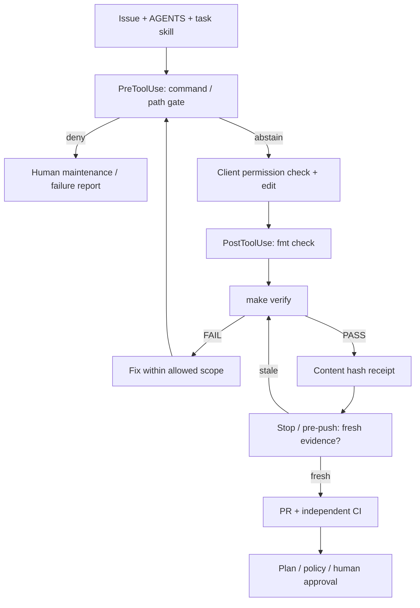

# Hooksとskillsによる検証ループ

[参考記事](https://nyosegawa.com/posts/harness-engineering-best-practices-2026/) の、
規約だけに頼らず機械判定を作業へ接続し、短いfeedbackで修正ループを回す考え方を取り入れています。
この記事の製品別機能や数値を前提にせず、接続仕様は公式資料で確認します。

## 責務を分ける

| 層 | このリポジトリでの役割 | 強制できる範囲 |
|---|---|---|
| AGENTS.md | 共通規約、nested scope、skillへの入口 | clientが読む必要がある |
| SKILL.md | 変更・planレビューの作業別手順 | 指示であり実行権限を付与しない |
| 共通Python gate | allowlist、path検査、検証記録、Git index/ref検査 | 呼び出された検査に対する決定論的な結果 |
| Git hooks | commit直前とpush直前にgateを実行 | インストールしたローカルGit操作 |
| Agent hooks | 操作前、編集直後、完了時のfeedback | 設定例の対象client / tool / event |
| CI / IAM / repository rules | 独立した検証と権限境界 | 外部設定が必要。ローカルhookを信用しない |



## Git hookを試す

固定版toolchainを導入したcloneのルートで実行します。自動インストールはしません。

```bash
make hooks-install
make verify
make harness-status
git add <reviewed-files>
git commit -m "Describe the change"
git push
```

`hooks-install` はそのcloneの `core.hooksPath=.githooks` のみ設定します。
既存の別hook pathは上書きせず停止します。チームの既存hookへ統合する場合はmaintainerが明示的に行います。

- **pre-commit**: indexにあるstate / plan / credentialの代表的なファイル名を拒否します。
  Terraform、tftest、lockfileの**staged blob**を実Terraformの `fmt -check -` に渡します。
  作業ファイルだけを直してstageし忘れた場合も拒否します。全てのsecretを検出するscannerではありません。
- **pre-push**: 現在のHEADを指すbranch updateだけを受け付け、tracked/untrackedの未commit変更、
  古い・欠けた検証記録を拒否します。別commit、tag、branch削除のpushはこの通常経路では拒否します。
  maintainerのrelease/削除手順とは別にします。

## 検証記録の扱い

`make verify` は開始時に古い `.harness/verification.json` を消します。
全検証が成功し、開始時と終了時で入力hashが一致した場合だけ新しい記録を書きます。
`make harness-status` は現在の内容を再計算し、不一致や記録欠如で非ゼロ終了します。

hashにはファイル名、内容、実行bitを含めます。Terraformだけでなくtest、policy、hook、skill、
lockfile、version pin、CI、docsも対象です。gitignoreされたtfvars/overrideも含みます。
mtimeの変更だけには依存しません。sourceの追加・削除・renameも検出します。
`.git`、`.terraform`、`.harness`、Python cache、state/plan等の生成物は対象外です。
symlinkを介した外部入力は拒否します。source/moduleをcacheや除外directoryへ配置してはいけません。
外部環境、binary差替え、backend、AWS driftをこのhashが証明するわけではありません。

この記録はローカルでの取り違えを防ぐ補助で、署名付きattestationではありません。
書込権限を持つ人は偽造できるため、CIは記録をキャッシュ/再利用せず毎回 `make verify` を実行します。
この記録をapply権限の根拠にしません。複数のverifyを同じcheckoutで同時実行しないでください。

## Agent hook接続例

`.claude/settings.json.example` はClaude Codeのcommand hookの任意の接続例です。
導入者が内容をレビューし、既存設定へmergeするか、設定がないcloneで次のようにコピーします。
既存ファイルを上書きしない例です。

```bash
cp -n .claude/settings.json.example .claude/settings.local.json
```

repoのルートでclientを起動し、root AGENTSと対象skillを明示的に読ませます。
client側でhook登録を確認してください。ローカル設定はコミット対象外です。
既存のpermission/sandbox設定を緩和する項目はこの例に含めていません。

| Event | 判定・feedback |
|---|---|
| PreToolUse / Bash | rootでの許可したmake入口と限定したGit readだけを受け付ける |
| PreToolUse / Write, Edit, MultiEdit | checkout外、symlink、state/credential、制御ファイル、prod/network scopeへの書込みを拒否 |
| PostToolUse / Write, Edit, MultiEdit | 20秒以内の `terraform fmt -check -recursive`。失敗時は修正入口を返す |
| Stop | 新鮮なverify記録がなければ一度修正を要求し、次もFAILなら失敗報告・人間への引渡しを許す |

許可する単純なコマンドは `make fmt/validate/test/lint/verify/python-test/policy-test/demo/harness-status`
（slashで区切った各targetを1つずつ実行）と、`git status --short`、`git diff`、
`git diff --stat`、`git diff --cached` です。追加引数やshellの合成は受け付けません。
実planは `make plan ENV=dev|staging VAR_FILE=/absolute/... BACKEND_CONFIG=/absolute/...`、
レビューは `make risk-summary|policy ENV=dev|staging|prod PLAN_JSON=/absolute/...` の形だけを受け付けます。
これらの `|` は候補の説明であり、実行時には1つを指定します。
prodの実planは保護されたrunnerへ渡します。

任意のshellを正しく解析できると仮定せず、`;`、pipe、改行、command substitution、環境変数の前置、
Makefile差替えなどを拒否する保守的なallowlistです。raw Terraform、AWS CLI、interpreter、apply、
destroy、state/import/force-unlockは通常profileのBashから使えません。
このスクリプト自身は入力commandを実行しません。

AGENTS、Makefile、tool pin/lock、`versions.tf` / `backend.tf`、scripts、policies、CI、hooks、skills、
prod、networkの編集は保護scopeです。任意のHCLの意味や別名file内のbackend/IAM blockまで判定する機構では
ありません。高リスク変更の検出はplan/policyと人間のレビューも使います。
このPRのような制御自体の変更は、通常agent profileに例外権限を足さず、maintainerの別作業としてレビューします。

PreToolUseで検査に通っても `permissionDecision: allow` は返さず、clientの権限判定に委ねます。
PostToolUseは編集後のfeedbackであり、変更を取り消しません。Stopは無限修正を避けるため
`stop_hook_active` を使って1回で引き渡します。引渡し時も検証記録とpre-pushはFAILのままであり、
「Stopできた」ことは成功を意味しません。

Codex、Copilot等は同じGit hooks / Make入口 / SKILL.mdを使えます。
この例からnative hook対応や自動skill発見を推測せず、使うclientの公式仕様に合わせてadapterを追加してください。
MCP tool、別shell tool、未登録event、UI経由の操作はこのClaude adapterの対象外です。

## Skillsの選択

- Terraformコードやmock assertionを変更する: `.agents/skills/terraform-change/SKILL.md`
- saved plan、risk、policy、production判断をレビューする: `.agents/skills/terraform-plan-review/SKILL.md`

[Agent Skills仕様](https://agentskills.io/specification) の `name` / `description` frontmatterを使用します。
`.agents/skills` の自動検出はclientごとに異なるため、AGENTSに明示的な入口も置きます。
skillを読むことはhookの解除、credentialの取得、Human Gateの通過を意味しません。
skillだけで分岐を強制せず、記載された検証をCLIとCIでも実行します。

## 検証と導入時の境界

`make python-test` はshell bypass、保護path、古い記録、ignored tfvars、staged artifact、
実Git hookの起動、別refのpush、JSON adapter、Stopの終了条件を検証します。
実Terraformがある場合は、indexだけが不正書式のケースも実CLIでテストします。
Terraformがない場合、その1件はSKIPとして表示します。全体verifyは依存不足でFAILです。
CIではTerraformを用意し、さらに全検証後に検証記録とpre-pushの接続を確認します。

実際のClaude Code/Codex/Copilotセッションはこの作成環境で起動していません。
JSON入出力契約のテストをnative clientでの動作確認とは区別します。
導入時にallow、deny、欠損tool、timeout、完了時のFAIL報告をそれぞれ試してください。

ローカルGit hookは `--no-verify` やconfig変更で迂回でき、repo内のhookも編集可能です。
MCPのread-only権限、ネットワーク/sandbox制限、AWS権限、required CI、CODEOWNERS、人間の承認を
外側で設定して初めて権限境界になります。強い分離が必要なら保護したrunnerからtrustedな検査器を実行し、
未レビューのコードへwrite credentialを渡さないでください。

## 仕様の根拠

- [参考記事: Harness Engineering Best Practices](https://nyosegawa.com/posts/harness-engineering-best-practices-2026/)
- [Claude Code hooks reference](https://code.claude.com/docs/en/hooks): event payload、deny、additionalContext、Stop
- [Agent Skills specification](https://agentskills.io/specification): portableなSKILL.md形式

仕様確認日: 2026-09-11。製品の仕様変更時はadapterのtestと接続例を一緒に更新します。
